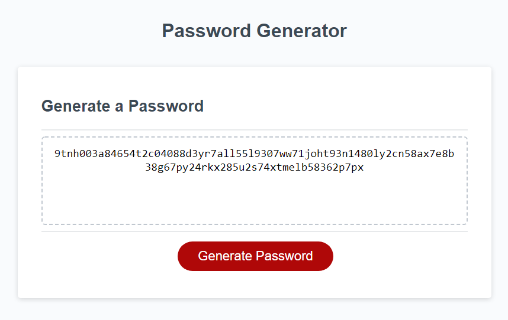

# JavaScript Challenge: Password Generator
Password Generator project for Rutgers Coding Bootcamp 
## Technologies Used:
- JavaScript
- HTML
- CSS
## Description
This is the repository for Challenge 3 of the Rutgers Coding Bootcamp. This application uses basic JavaScript to generate a random password based on a series of prompts.

[Link to the deployed page](https://owlbag.github.io/password-generator/)
